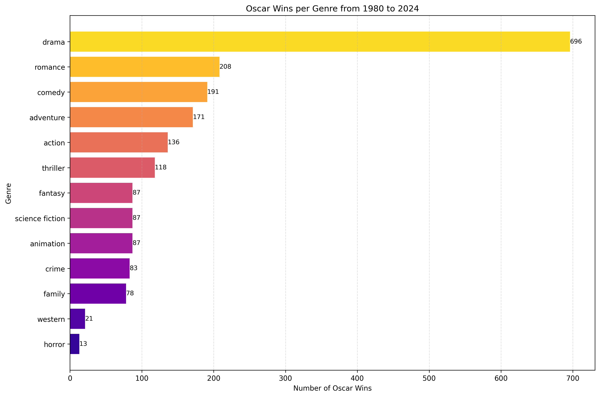
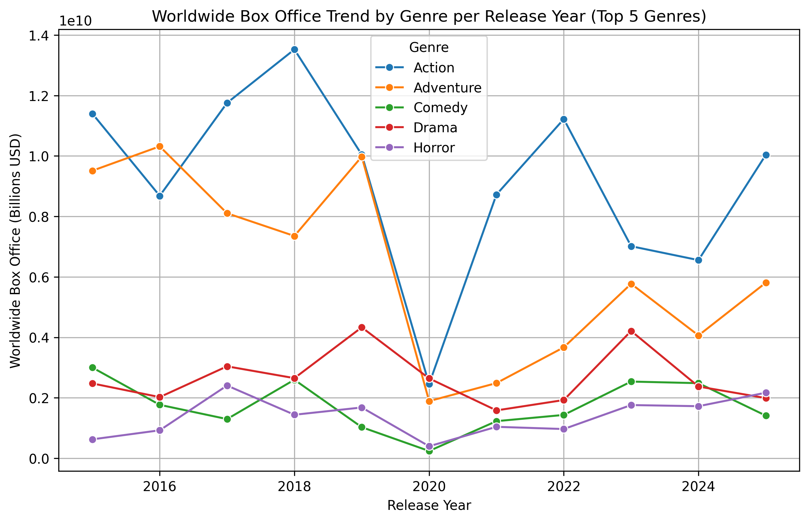
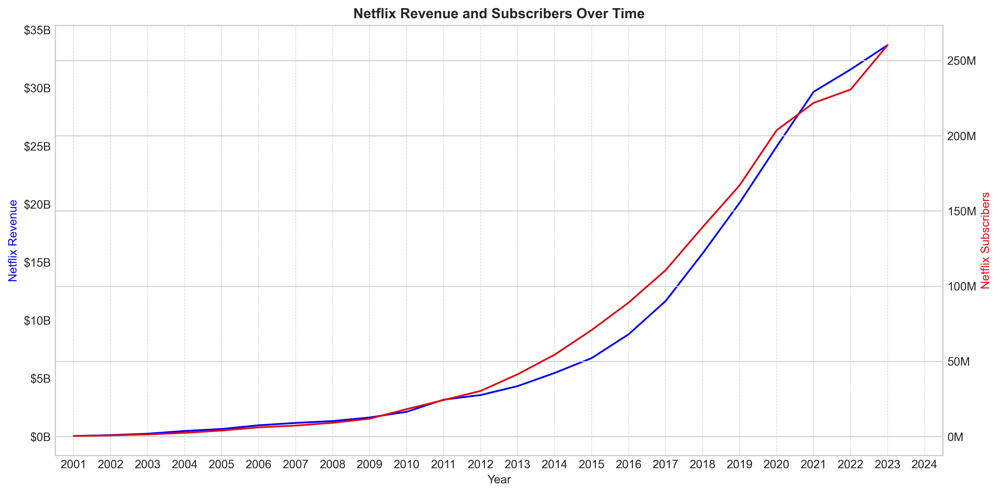
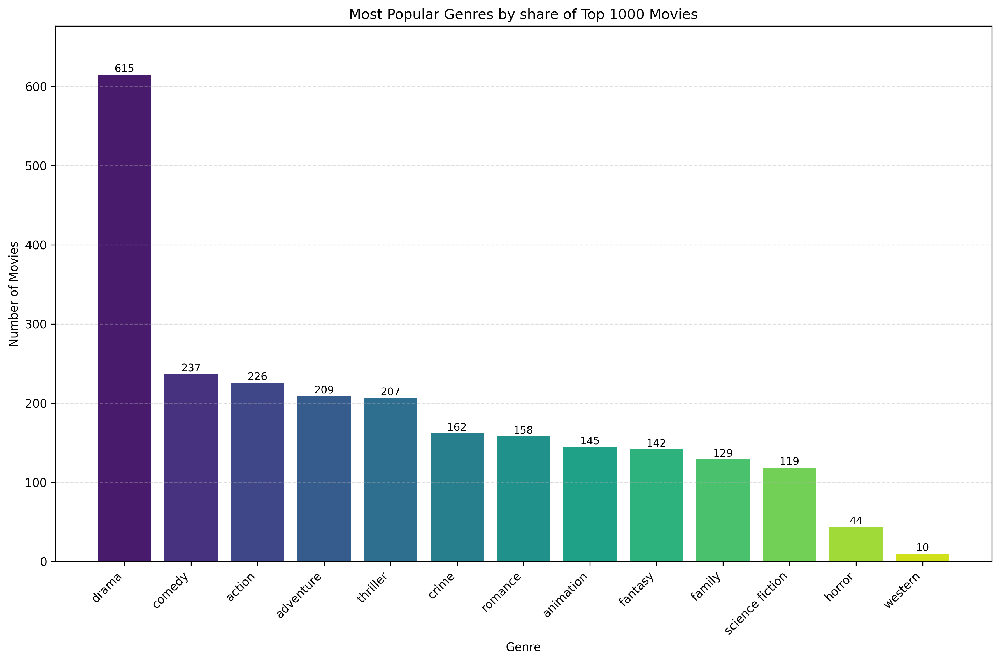

# Film Industry Data Analysis

Project repository for exploratory analysis and visualisation of film and streaming industry data, focused on industry-wide trends, box-office performance, awards analysis, and a Netflix case study.

### **Project Overview**

This project analyzes multiple public film and streaming datasets to surface trends across box office performance, streaming engagement, and awards outcomes. The work includes data cleaning and merging, exploratory analysis, and interactive visualisations. Major threads in the analysis:
- Industry trends (box office & popular genres over time)
- Awards analysis (Oscars, BAFTA and their relationship to popularity and box office)
- Streaming case study (Netflix engagement, revenue, subscribers and spend)

**Research Questions**

- How have box office and popularity trends changed over the last decade? 
- How do awards (Oscars/BAFTA) relate to box office performance and popularity metrics?
- What patterns appear in Netflix engagement and how do revenue, subscribers, and spend relate over time?
- Which genres and companies consistently produce top-performing films by box office, popularity or awards?

**Key Findings (high-level)**

- Netflix’s growth reflects a shift from rapid subscriber expansion to a mature model driven by high engagement and sustained content investment (see Netflix case study).
- Top-rated films are consistently driven by drama-led storytelling and dominated by major studios, with animation standing out in quality and genre diversity increasing in more recent eras.
- Box office success is highly concentrated among major studios and action‑adventure franchises, with performance shaped by blockbuster-driven demand and temporarily disrupted by COVID-driven shifts in genre mix and theatrical dynamics.
- Oscar success remains anchored in drama and concentrated among major studios, while gradually evolving toward greater genre diversity and shifting studio leadership over time.

### **Visualisations & Previews**

Visual outputs are available in the `outputs/` directory; notable subfolders:
- `outputs/box_office_analysis/` — box office time series and comparisons
- `outputs/streaming_analysis_netflix/` — Netflix engagement and revenue visualisations
- `outputs/awards_analysis_oscars/` — award-related charts and winner analyses

Open the notebook `notebooks/visualisation_notebook.ipynb` to reproduce and interact with the figures. Static previews are included in `outputs/` and generated PNGs from the notebook cells.

**Preview Gallery**

<!-- Using HTML instead of markdown code to display image , because iamge size can't be adjusted with markdown -->

- **Awards (Oscars)** — total wins by genre:

	

- **Box Office** — worldwide box office trend by genre:

	

- **Streaming (Netflix)** — revenue vs subscribers:

	

- **TMDB Popularity** — popular genres among top 1000 titles:

	

<strong>**Interactive Dashboard (Tableau)**</strong>

An interactive version of this analysis is available on Tableau Public, featuring alternative visualisations and a dashboard-style exploration of the data:

[Film & TV Analysis | Tableau Public](https://public.tableau.com/app/profile/fanny.sanz/viz/FilmTVAnalysis/Story)

The Tableau dashboard complements the Python analysis by providing:
- Interactive filtering and exploration
- Alternative visual representations of key metrics
- A more presentation-focused view of the results

 

### **Data Sources**

Key datasets included in the `data/` folder:

- Final datasets used in the analysis are available in `data/analysis_data/`
- These datasets are pre-processed and can be used directly with the notebook
- Example files:
  - Streaming / Netflix : `data/analysis_data/cleaned_netflix_engagement`
  - Merged Awards & TMDB: `data/analysis_data/merged_oscar_tmdb`
  - Box Office : `data/analysis_data/cleaned_the_numbers`

  These files are sufficient to fully reproduce all visualisations and results in the project.

**Raw and intermediate datasets (not included):**
- Original source files (TMDB, Netflix, Box Office Mojo, etc.) and intermediate cleaned datasets are **not included in the repository** due to size constraints
- These are excluded via `.gitignore`

**Data pipeline scripts:**
- Data ingestion, cleaning, and merging logic is available in:
  - [scripts/load_data.py](scripts/load_data.py)
  - [scripts/merge_data.py](scripts/merge_data.py)

See the python scripts for full ingestion and cleaning steps: [scripts/load_data.py](scripts/load_data.py) and [scripts/merge_data.py](scripts/merge_data.py).

### **How to run / reproduce**

The project is designed to be **easy to explore without requiring full reprocessing of the data pipeline**.

**Option 1 — Quick exploration (no setup required):**
- Browse pre-generated figures in the `outputs/` directory.
- View the preview gallery in this README.

**Option 2 — Run the analysis notebook:**
1. Install dependencies: pip install -r requirements.txt
2. Open `notebooks/visualisation_notebook.ipynb`
3. Run the notebook cells to reproduce figures and explore the data

Pre-processed datasets are already provided in `data/analysis_data/`, so no additional data preparation is required.

### **Limitations**

- Dataset merging: different sources use inconsistent identifiers and naming conventions, resulting in incomplete joins and some unmatched records.
- Temporal coverage varies across datasets (e.g., some span 2015–2025 while others cover longer historical periods), limiting direct comparability over time.
- Popularity metrics (e.g., TMDB average vote) are proxies and do not directly reflect revenue or critical reception.
- Data quality issues: missing values, inconsistent genre/company labels, and varying levels of metadata completeness.
- Source discrepancies: key metrics (e.g., box office revenue, ratings, genres) can differ across providers (e.g., The Numbers vs. Box Office Mojo, TMDB vs. IMDb).

### **Next Improvements**

- Integrating additional sources where feasible e.g. Box Office Mojo, BAFTA data
- Refine box office analysis by separating domestic vs. international revenue and enabling more granular comparisons.
- Expand awards analysis to category-level (e.g., Oscar categories by genre) to uncover more detailed patterns.
- Extend the Netflix case study by analysing content type (e.g., originals vs. licensed) and engagement differences.
- Add inflation-adjusted revenue for more accurate box office comparisons.
- Explore automated data ingestion (e.g., APIs or scraping where permissible) to enable updates with more recent data.
- Explore forecasting models (time-series forecasting for box office and netflix metrics and streaming engagement) and ML methods for predicting awards likelihood.

---
